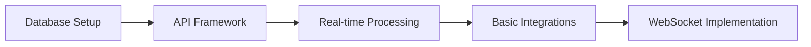
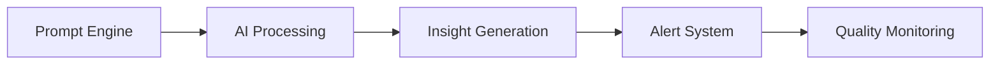
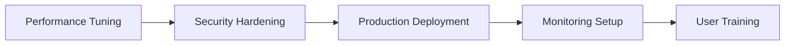

# RevOps Automation Platform - Complete Implementation Guide

## Platform Overview
The RevOps Automation Platform transforms how revenue operations teams work by automatically unifying data from all GTM tools and generating AI-powered insights. This eliminates manual data copying, CRM cleanup, forecasting, and report preparation.

## 🚀 What We're Building

### Core Vision
- **Eliminate Manual Work**: No more copying data between tools, fixing CRM fields, or preparing slides
- **Real-time Intelligence**: Every event from every tool processed and analyzed instantly
- **Leadership Ready Reports**: Weekly/monthly reports generated automatically via AI
- **Proactive Alerts**: Get notified about at-risk deals, churn signals, and pipeline changes

### Key Capabilities

#### 🔄 **Multi-Tool Integrations**
Connect to all your GTM systems:
- **CRM**: Salesforce, HubSpot
- **Sales Engagement**: Outreach, Salesloft, Gong
- **Marketing**: HubSpot Marketing, Marketo
- **Support**: Zendesk, Freshdesk
- **Billing**: Stripe, Chargebee
- **Communication**: Gmail, Google Calendar
- **Collaboration**: Slack, Teams
- **Data Sources**: Google Sheets, CSV, SFTP uploads

#### 🧠 **AI-Powered Intelligence**
- **Deal Health Scoring**: Real-time risk assessment and win probability
- **Forecast Accuracy**: AI-enhanced revenue forecasting
- **Churn Prediction**: Early warning system for customer retention
- **Automated Reporting**: Leadership-ready reports in PDF, PPT, Slack
- **Smart Alerts**: Contextual notifications with actionable recommendations

#### 🛡️ **CRM Hygiene Engine**
- **50+ Pre-built Rules**: Field validation, business rules, data quality checks
- **Auto-Fix Capabilities**: Automatically resolve common data issues
- **Bulk Operations**: Mass updates with audit trails
- **Custom Rules Builder**: Create organization-specific hygiene rules

## 📋 System Architecture

### Technology Stack
```
Frontend: Next.js 14 + TypeScript + Tailwind CSS
Backend: Node.js + API Routes + Microservices
Database: Supabase (PostgreSQL 15+) + Time-series data
Real-time: WebSocket + Redis Queue
AI: Anthropic Claude 3.5 Sonnet + Vector Search
Integration: OAuth2 + Webhooks + API Connectors
Security: Row-level security + End-to-end encryption
```

### Core Components

#### 🌐 **Integration Hub**
- Webhook ingestion (1000+ events/second)
- OAuth2 token management with auto-refresh
- Rate limiting and error recovery
- Event deduplication and validation

#### ⚡ **Real-time Processing Pipeline**
```
GTM Tool → Webhook → Event Queue → Normalization → Business Rules → Database → WebSocket → AI Processing → Alerts
```

#### 🗄️ **Unified Data Model**
- **Canonical Schema**: Single source of truth for all data
- **Event Streaming**: Immutable audit trail of all changes
- **Materialized Views**: Optimized for dashboard performance
- **Change Data Capture**: Real-time sync capabilities

#### 🤖 **AI Processing Engine**
- Context aggregation (deal + account + activities)
- Multi-model inference (forecasting, risk, sentiment)
- Prompt engineering optimized for each use case
- Continuous learning from customer feedback

## 🛠️ Implementation Status

### ✅ **Completed**
1. **System Architecture Design** - Complete technical blueprint
2. **Database Schema** - Unified GTM data model with all tables
3. **Real-time Data Flow** - Event processing pipeline architecture
4. **API Specifications** - Full REST API with WebSocket support
5. **AI Prompt Flows** - Comprehensive prompt engineering framework

### 🚧 **In Progress**
6. **CRM Hygiene Engine** - Rule processing and auto-fix logic
7. **Alert System Design** - Multi-channel notification architecture

### 📋 **Planned**
8. **User Onboarding** - Guided setup and integration flows
9. **Dashboard Design** - UX components and architecture
10. **Integration Specs** - Detailed provider implementations

## 📊 Key Features Overview

### 1. **Pipeline Intelligence**
```typescript
// Real-time pipeline metrics
const pipelineMetrics = await api.metrics.getPipeline({
  period: 'WEEKLY',
  dimensions: ['owner', 'stage', 'deal_size'],
  forecasts: true
});

// AI-powered insights
const insights = await api.ai.getInsights({
  type: 'PIPELINE_RISK',
  severity: ['HIGH', 'CRITICAL']
});
```

### 2. **Deal Health Scoring**
```typescript
// Comprehensive deal analysis
const dealHealth = await api.deals.getHealth(dealId, {
  include: ['similar_deals', 'risk_factors', 'win_probability'],
  depth: 'full'
});

// Smart alerts
await api.alerts.create({
  type: 'DEAL_STAGNATION',
  trigger: { days_in_stage: 14, deal_value: 100000 },
  actions: ['EXECUTIVE_ESCALATION', 'FORECAST_ADJUSTMENT']
});
```

### 3. **Automated Reporting**
```typescript
// Leadership-ready reports
const report = await api.reports.generate({
  template: 'monthly_board_report',
  period: { from: '2024-01-01', to: '2024-01-31' },
  delivery: {
    channels: ['email', 'slack'],
    schedule: 'first_monday_9am'
  },
  ai_enhancement: true
});
```

### 4. **CRM Hygiene**
```typescript
// Rule-based data quality
const issues = await api.hygiene.getIssues({
  severity: ['HIGH', 'CRITICAL'],
  auto_fix: true
});

// Custom rule creation
await api.hygiene.createRule({
  name: 'High-value deal validation',
  condition: {
    and: [
      { amount: { gt: 100000 } },
      { stage: ['Proposal', 'Negotiation'] },
      { competitor: { is_null: true } }
    ]
  },
  action: { type: 'NOTIFY_SALES_MANAGER' }
});
```

## 🔄 Implementation Workflow

### Phase 1: **Core Infrastructure** (4-6 weeks)


### Phase 2: **AI Integration** (3-4 weeks)


### Phase 3: **Feature Development** (4-6 weeks)
```mermaid
graph LR
A[CRM Hygiene] --> B[Reporting Engine]
B --> C[Dashboard Components]
D -> C[User Experience]
C --> E[Native Mobile App]
```

### Phase 4: **Scale & Optimization** (2-3 weeks)


## 🎓 Success Metrics

### Technical Metrics
- **Event Processing Latency**: < 1 second from webhook to dashboard
- **API Response Time**: < 200ms for cached queries
- **Dashboard Load Time**: < 2 seconds initial load
- **Concurrent Users**: 10,000+ per instance
- **Data Freshness**: Real-time (< 5 seconds)

### Business Metrics
- **Manual Work Reduction**: 90% decrease in manual data tasks
- **Forecast Accuracy**: 25% improvement in prediction accuracy
- **Churn Detection**: 75% of at-risk customers identified 30 days prior
- **Sales Cycle Optimization**: 20% reduction in average sales cycle

### User Experience
- **Onboarding Time**: < 15 minutes for first integration
- **Daily Usage**: > 80% of sales team engaged daily
- **Report Generation**: < 30 seconds for complex reports
- **Alert Response**: < 1 hour average response time to critical alerts

## 🔧 Development Environment

### Local Development Setup
```bash
# Clone and setup
git clone <repository>
cd revops-platform
npm install

# Environment setup
cp .env.example .env.local
# Configure Supabase, Redis, Claude API keys

# Start development stack
npm run dev:db      # Supabase local
npm run dev:redis   # Redis server
npm run dev         # Next.js application

# Run tests
npm run test:unit
npm run test:integration
npm run test:e2e
```

### Database Migration
```bash
# Initialize schema
npm run db:migrate

# Load sample data
npm run db:seed

# Run performance tests
npm run db:benchmark
```

### Integration Testing
```bash
# Mock webhook testing
npm run test:webhooks

# Load testing
npm run test:load

# End-to-end integration tests
npm run test:e2e:integrations
```

## 📚 Documentation Structure

### Architecture Documents
1. **SYSTEM_ARCHITECTURE.md** - Complete technical blueprint
2. **DATABASE_SCHEMA.md** - Unified data model and relationships
3. **REAL_TIME_DATA_FLOW.md** - Event processing pipeline
4. **API_SPECIFICATIONS.md** - Full REST API documentation

### Feature Specifications
5. **AI_PROMPT_FLOWS.md** - Comprehensive prompt engineering
6. **CRM_HYGIENE_ENGINE.md** - Data quality automation
7. **ALERTS_NOTIFICATIONS.md** - Multi-channel alerting system

### User Experience
8. **ONBOARDING_FLOW.md** - Guided user setup process
9. **DASHBOARD_DESIGN.md** - UX components and interactions
10. **INTEGRATION_SPECS.md** - Detailed provider implementations

## 🎯 Getting Started

### For Developers
1. **Read SYSTEM_ARCHITECTURE.md** - Understand the full system design
2. **Review DATABASE_SCHEMA.md** - Learn the unified data model
3. **Run API_SPECIFICATIONS.md** examples - Test the endpoints
4. **Implement AI_PROMPT_FLOWS.md** - Add custom prompt logic

### For Product Managers
1. **Review onboarding flow** - Understand user journey
2. **Analyze dashboard components** - Plan feature rollout
3. **Plan integration priorities** - Choose initial providers
4. **Define success metrics** - Track platform adoption

### For Sales Ops Teams
1. **Test hygiene rules** - Configure data quality automation
2. **Set up alerts** - Configure notification preferences
3. **Design reports** - Customize leadership templates
4. **Train team members** - Roll out to sales organization

## 🔄 Continuous Improvement

### A/B Testing Framework
- Prompt variant testing for AI outputs
- UI/UX component optimization
- Integration flow improvements
- Alert effectiveness measurement

### Performance Monitoring
- Real-time system metrics
- API performance tracking
- Database query optimization
- Caching strategy evaluation

### User Feedback Loop
- In-app feedback collection
- Quarterly user interviews
- Feature utilization analytics
- Support ticket analysis

## 🚀 Production Deployment

### Infrastructure Setup
```yaml
# Docker Compose for production
services:
  app:
    image: revops-platform:latest
    replicas: 3
    load_balancer: nginx
    
  database:
    type: postgresql_15
    replicas: 2
    failover: automatic
    
  redis:
    cluster: enabled
    nodes: 3
    
  monitoring:
    prometheus: yes
    grafana: yes
    alertmanager: yes
```

### Security Checklist
- [ ] SSL/TLS certificate configuration
- [ ] Database encryption at rest
- [ ] API rate limiting rules
- [ ] Audit logging enabled
- [ ] Backup verification procedures
- [ ] Penetration testing completed
- [ ] Compliance audit passed (SOC 2, GDPR)

---

## 📞 Next Steps

This platform will revolutionize how RevOps teams work, eliminating manual data tasks and providing real-time intelligence that helps organizations close deals faster and retain customers longer.

The implementation is broken into manageable phases with clear deliverables at each stage. Start with Phase 1 infrastructure, then progressively add AI capabilities and advanced features.

**Ready to begin?** Let's start with the database setup and API framework implementation.
