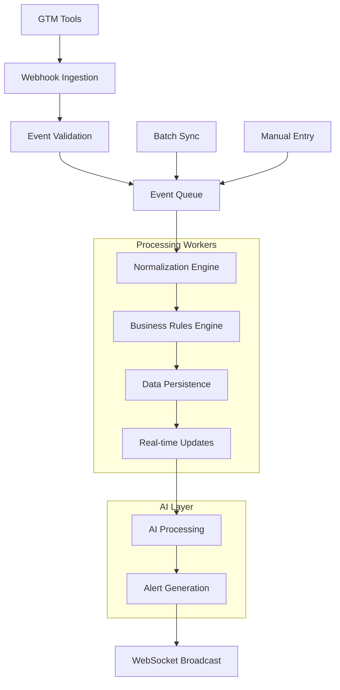

# Real-Time Data Flow Architecture

## Overview
The real-time data flow ensures that any event from any GTM tool is processed, normalized, and made available in dashboards within seconds. This architecture handles high-volume event processing while maintaining data consistency and reliability.

## Event Processing Pipeline



## 1. Event Ingestion Layer

### Webhook Receiver
```typescript
// app/api/webhooks/[provider]/route.ts
interface WebhookEvent {
  provider: string;
  eventType: string;
  timestamp: string;
  signature?: string;
  payload: any;
  headers: Record<string, string>;
}

export async function POST(request: Request, { params }: { params: { provider: string } }) {
  const provider = params.provider;
  const body = await request.text();
  const headers = Object.fromEntries(request.headers.entries());
  
  // Security validation
  const isValid = await WebhookValidator.validate(provider, body, headers);
  if (!isValid) {
    return NextResponse.json({ error: 'Invalid signature' }, { status: 401 });
  }
  
  // Parse and queue
  const event = WebhookParser.parse(provider, body);
  await EventQueue.enqueue('webhook-processing', {
    provider,
    event,
    timestamp: new Date().toISOString()
  });
  
  return NextResponse.json({ received: true });
}
```

### Event Validation
```typescript
// lib/processors/event-validator.ts
export class EventValidator {
  static async validate(provider: string, eventType: string, payload: any): Promise<boolean> {
    const schema = EventSchemaRegistry.get(provider, eventType);
    return schema.validate(payload);
  }
  
  static async deduplicate(eventId: string): Promise<boolean> {
    const exists = await redis.get(`event:${eventId}`);
    if (exists) return true;
    
    await redis.setex(`event:${eventId}`, 86400, '1'); // 24 hour TTL
    return false;
  }
  
  static async rateLimit(customerId: string, count: number): Promise<boolean> {
    const key = `rate-limit:${customerId}:${Math.floor(Date.now() / 60000)}`; // per minute
    const current = await redis.incr(key);
    if (current === 1) await redis.expire(key, 60);
    return current <= count;
  }
}
```

## 2. Event Queue System

### Redis/Bull Queue Configuration
```typescript
// lib/queue/event-queue.ts
import Bull from 'bull';

export const eventQueue = new Bull('event-processing', {
  redis: {
    host: process.env.REDIS_HOST,
    port: parseInt(process.env.REDIS_PORT!),
    password: process.env.REDIS_PASSWORD,
  },
  defaultJobOptions: {
    removeOnComplete: 1000,
    removeOnFail: 1000,
    attempts: 3,
    backoff: 'exponential',
  },
  limiter: {
    max: 1000, // 1000 jobs per 5 seconds
    duration: 5000,
  },
});

// Queue processors
eventQueue.process('webhook-processing', 50, async (job) => {
  const { provider, event, timestamp } = job.data;
  await processWebhookEvent(provider, event, timestamp);
});

eventQueue.process('batch-sync', 10, async (job) => {
  const { customerId, provider } = job.data;
  await processBatchSync(customerId, provider);
});

eventQueue.process('ai-insights', 20, async (job) => {
  const { customerId, entityId, entityType } = job.data;
  await generateAIInsights(customerId, entityId, entityType);
});
```

### Worker Configuration
```typescript
// lib/workers/event-processor.ts
export class EventProcessor {
  static async processEvent<T extends BaseEvent>(
    provider: string,
    eventType: string,
    payload: T
  ): Promise<ProcessingResult> {
    try {
      // 1. Normalize event to canonical format
      const normalizedEvent = await NormalizationEngine.normalize(provider, eventType, payload);
      
      // 2. Apply business rules
      const enrichedEvent = await BusinessRulesEngine.process(normalizedEvent);
      
      // 3. Persist to database
      const persistedEvent = await persistEvent(enrichedEvent);
      
      // 4. Trigger updates
      await triggerRealtimeUpdates(persistedEvent);
      
      // 5. Queue AI processing
      await queueAIProcessing(persistedEvent);
      
      return { success: true, eventId: persistedEvent.id };
    } catch (error) {
      console.error(`Event processing failed: ${error.message}`);
      throw error;
    }
  }
}
```

## 3. Normalization Engine

### Canonical Event Schema
```typescript
// lib/types/events.ts
export interface CanonicalEvent {
  id: string;
  customerId: string;
  provider: string;
  eventType: string;
  entityType: EntityType;
  entityId: string;
  timestamp: string;
  
  // Standardized fields
  changes: Record<string, any>;
  metadata: {
    source: string;
    version: string;
    context: Record<string, any>;
  };
  
  // Relationships
  relatedEntities?: {
    deals?: string[];
    accounts?: string[];
    contacts?: string[];
    campaigns?: string[];
  };
}

export enum EntityType {
  DEAL = 'DEAL',
  ACCOUNT = 'ACCOUNT',
  CONTACT = 'CONTACT',
  ACTIVITY = 'ACTIVITY',
  CAMPAIGN = 'CAMPAIGN',
  SUPPORT_TICKET = 'SUPPORT_TICKET',
  INVOICE = 'INVOICE',
  SUBSCRIPTION = 'SUBSCRIPTION',
}
```

### Provider-Specific Normalizers
```typescript
// lib/normalizers/salesforce.ts
export class SalesforceNormalizer implements Normalizer {
  async normalize(eventType: string, payload: any): Promise<CanonicalEvent> {
    switch (eventType) {
      case 'Opportunity.Created':
        return this.normalizeOpportunityCreated(payload);
      case 'Opportunity.Updated':
        return this.normalizeOpportunityUpdated(payload);
      case 'Task.Created':
        return this.normalizeActivityCreated(payload);
      default:
        throw new Error(`Unsupported event type: ${eventType}`);
    }
  }
  
  private normalizeOpportunityCreated(payload: any): CanonicalEvent {
    return {
      id: `${payload.Id}_SF_opp_created`,
      customerId: payload.CustomerId__c,
      provider: 'salesforce',
      eventType: 'deal.created',
      entityType: EntityType.DEAL,
      entityId: payload.Id,
      timestamp: payload.CreatedDate,
      changes: {
        name: payload.Name,
        amount: payload.Amount,
        stage: payload.StageName,
        closeDate: payload.CloseDate,
        probability: payload.Probability,
        ownerId: payload.OwnerId,
        accountId: payload.AccountId,
      },
      metadata: {
        source: 'salesforce_webhook',
        version: 'v1',
        context: {
          recordTypeId: payload.RecordTypeId,
          recordType: payload.RecordType?.Name,
        },
      },
      relatedEntities: {
        accounts: payload.AccountId ? [payload.AccountId] : undefined,
      },
    };
  }
}

// lib/normalizers/hubspot.ts
export class HubSpotNormalizer implements Normalizer {
  async normalize(eventType: string, payload: any): Promise<CanonicalEvent> {
    // Similar normalization for HubSpot events
  }
}
```

### Field Mapping Engine
```typescript
// lib/normalizers/field-mapper.ts
export class FieldMapper {
  private static readonly FIELD_MAPPINGS = {
    salesforce: {
      opp: {
        'Amount': 'amount',
        'StageName': 'stage',
        'CloseDate': 'closeDate',
        'Probability': 'probability',
        'LeadSource': 'source',
        'Type': 'dealType',
        'ForecastCategory': 'forecastCategory',
      },
      account: {
        'Name': 'name',
        'Industry': 'industry',
        'AnnualRevenue': 'arr',
        'Type': 'accountType',
      },
    },
    hubspot: {
      deal: {
        'amount': 'amount',
        'dealstage': 'stage',
        'closedate': 'closeDate',
        'pipeline': 'pipelineName',
        'dealtype': 'dealType',
      },
    },
  };
  
  static map(provider: string, entityType: string, fields: Record<string, any>): Record<string, any> {
    const mapping = this.FIELD_MAPPINGS[provider]?.[entityType] || {};
    const mapped: Record<string, any> = {};
    
    for (const [sourceField, value] of Object.entries(fields)) {
      const targetField = mapping[sourceField] || sourceField.toLowerCase();
      mapped[targetField] = this.transformValueType(targetField, value);
    }
    
    return mapped;
  }
  
  private static transformValueType(field: string, value: any): any {
    if (!value) return value;
    
    switch (field) {
      case 'amount':
      case 'arr':
        return typeof value === 'string' ? parseFloat(value.replace(/[$,]/g, '')) : value;
      case 'closeDate':
      case 'createdDate':
        return new Date(value).toISOString();
      case 'probability':
        return parseInt(value);
      default:
        return value;
    }
  }
}
```

## 4. Business Rules Engine

### Rule Definition
```typescript
// lib/rules/rule-engine.ts
export interface BusinessRule {
  id: string;
  name: string;
  description: string;
  condition: RuleCondition;
  actions: RuleAction[];
  priority: number;
  enabled: boolean;
}

export interface RuleCondition {
  entityType: EntityType;
  field?: string;
  operator: 'eq' | 'ne' | 'gt' | 'lt' | 'gte' | 'lte' | 'in' | 'contains' | 'custom';
  value?: any;
  customFunction?: string;
  and?: RuleCondition[];
  or?: RuleCondition[];
}

export interface RuleAction {
  type: 'SET_FIELD' | 'CREATE_TASK' | 'SEND_ALERT' | 'TRIGGER_WEBHOOK' | 'RUN_AI_ANALYSIS';
  parameters: Record<string, any>;
}
```

### Rule Processing
```typescript
// lib/rules/processor.ts
export class BusinessRulesEngine {
  static async processEvent(event: CanonicalEvent): Promise<CanonicalEvent> {
    const rules = await this.getApplicableRules(event.customerId, event.entityType);
    
    for (const rule of rules.sort(r => r.priority)) {
      if (await this.evaluateCondition(rule.condition, event)) {
        event = await this.executeActions(rule.actions, event);
      }
    }
    
    return event;
  }
  
  private static async evaluateCondition(condition: RuleCondition, event: CanonicalEvent): Promise<boolean> {
    // Complex rule evaluation logic
    // Includes field comparisons, lookups, custom functions
  }
  
  private static async executeActions(actions: RuleAction[], event: CanonicalEvent): Promise<CanonicalEvent> {
    for (const action of actions) {
      switch (action.type) {
        case 'SET_FIELD':
          event.metadata[action.parameters.field] = action.parameters.value;
          break;
        case 'SEND_ALERT':
          await AlertService.sendAlert({
            customerId: event.customerId,
            entityId: event.entityId,
            entityType: event.entityType,
            alertType: action.parameters.alertType,
            message: action.parameters.message,
          });
          break;
        case 'RUN_AI_ANALYSIS':
          await EventQueue.enqueue('ai-insights', {
            customerId: event.customerId,
            entityId: event.entityId,
            entityType: event.entityType,
            trigger: 'business_rule',
          });
          break;
      }
    }
    return event;
  }
}
```

## 5. Data Persistence Layer

### Transaction Management
```typescript
// lib/database/persistence.ts
export class EventPersistence {
  static async persist(event: CanonicalEvent): Promise<PersistedEvent> {
    const { data: persistedEvent, error } = await supabase
      .from('events')
      .insert({
        customer_id: event.customerId,
        event_type: event.eventType,
        event_category: this.getEventCategory(event.eventType),
        source_system: event.provider,
        external_id: event.id,
        entity_type: event.entityType,
        entity_id: event.entityId,
        payload: event,
        sequence_number: await this.getNextSequenceNumber(event.customerId),
        created_at: event.timestamp,
      })
      .select()
      .single();
    
    if (error) throw error;
    
    // Update the actual entity
    await this.updateEntity(event);
    
    // Create change log entry
    await this.createChangeLogEntry(event);
    
    return persistedEvent;
  }
  
  private static async updateEntity(event: CanonicalEvent): Promise<void> {
    switch (event.entityType) {
      case EntityType.DEAL:
        await this.updateDealFromEvent(event);
        break;
      case EntityType.ACCOUNT:
        await this.updateAccountFromEvent(event);
        break;
      case EntityType.CONTACT:
        await this.updateContactFromEvent(event);
        break;
      // ... other entity types
    }
  }
}
```

### Optimistic Concurrency Control
```typescript
// lib/database/concurrency.ts
export class ConcurrencyController {
  static async updateWithRetry<T>(
    table: string,
    id: string,
    updates: Partial<T>,
    maxRetries: number = 3
  ): Promise<T> {
    let retries = 0;
    
    while (retries < maxRetries) {
      try {
        // Get current version
        const { data: current, error: fetchError } = await supabase
          .from(table)
          .select('version')
          .eq('id', id)
          .single();
        
        if (fetchError) throw fetchError;
        
        // Update with version check
        const { data: updated, error: updateError } = await supabase
          .from(table)
          .update({
            ...updates,
            version: current.version + 1,
            updated_at: new Date().toISOString(),
          })
          .eq('id', id)
          .eq('version', current.version)
          .select()
          .single();
        
        if (updateError) {
          if (updateError.code === 'PGRST116') {
            // Version conflict, retry
            retries++;
            await this.delay(Math.pow(2, retries) * 100); // Exponential backoff
            continue;
          }
          throw updateError;
        }
        
        return updated;
        
      } catch (error) {
        if (retries === maxRetries - 1) throw error;
        retries++;
        await this.delay(Math.pow(2, retries) * 100);
      }
    }
    
    throw new Error('Max retries exceeded');
  }
  
  private static delay(ms: number): Promise<void> {
    return new Promise(resolve => setTimeout(resolve, ms));
  }
}
```

## 6. Real-time Updates

### WebSocket Broadcasting
```typescript
// lib/websocket/broadcaster.ts
import { Server as SocketIOServer } from 'socket.io';

export class WebSocketBroadcaster {
  private io: SocketIOServer;
  
  constructor(io: SocketIOServer) {
    this.io = io;
  }
  
  async broadcastEntityUpdate(event: CanonicalEvent): Promise<void> {
    const customers = await this.getSubscribedCustomers(event.customerId, event.entityType);
    
    customers.forEach(customerId => {
      this.io.to(`customer:${customerId}`).emit('entity_update', {
        entityType: event.entityType,
        entityId: event.entityId,
        changes: event.changes,
        timestamp: event.timestamp,
      });
    });
  }
  
  async broadcastMetricUpdate(customerId: string, metric: MetricUpdate): Promise<void> {
    this.io.to(`customer:${customerId}`).emit('metric_update', {
      type: metric.type,
      value: metric.value,
      dimensions: metric.dimensions,
      timestamp: new Date().toISOString(),
    });
  }
  
  async broadcastAlert(alert: Alert): Promise<void> {
    this.io.to(`customer:${alert.customerId}`).emit('new_alert', alert);
    
    // Also send to specific users if configured
    if (alert.assignedTo) {
      this.io.to(`user:${alert.assignedTo}`).emit('assigned_alert', alert);
    }
  }
}
```

### Client-side Real-time Integration
```typescript
// hooks/use-realtime.ts
export function useRealtimeUpdates(customerId: string) {
  const { data: session } = useSession();
  const [socket, setSocket] = useState<Socket | null>(null);
  const queryClient = useQueryClient();
  
  useEffect(() => {
    if (!session) return;
    
    const newSocket = io('/realtime', {
      auth: { token: session.accessToken },
    });
    
    newSocket.emit('join_customer', customerId);
    
    newSocket.on('entity_update', (update) => {
      queryClient.invalidateQueries({
        queryKey: [update.entityType, update.entityId],
      });
      
      queryClient.setQueryData(
        [update.entityType, update.entityId],
        (old: any) => ({ ...old, ...update.changes })
      );
    });
    
    newSocket.on('metric_update', (metric) => {
      queryClient.invalidateQueries(['metrics']);
    });
    
    newSocket.on('new_alert', (alert) => {
      queryClient.invalidateQueries(['alerts']);
    });
    
    setSocket(newSocket);
    
    return () => newSocket.close();
  }, [session, customerId, queryClient]);
  
  return socket;
}
```

## 7. AI Processing Pipeline

### Insight Generation
```typescript
// lib/ai/insights-generator.ts
export class AIInsightsGenerator {
  static async generateForDeal(customerId: string, dealId: string): Promise<AIInsight[]> {
    // Gather context
    const context = await this.buildDealContext(customerId, dealId);
    
    // Generate insights using AI
    const prompt = this.buildDealInsightPrompt(context);
    const aiResponse = await claudeAPI.generate(prompt);
    
    // Parse and store insights
    const insights = this.parseInsights(aiResponse, {
      customerId,
      entityType: 'DEAL',
      entityId: dealId,
    });
    
    await this.storeInsights(insights);
    
    return insights;
  }
  
  private static async buildDealContext(customerId: string, dealId: string): Promise<DealContext> {
    const [deal, account, activities, competitors, similarDeals] = await Promise.all([
      getDeal(customerId, dealId),
      getDealAccount(customerId, dealId),
      getDealActivities(customerId, dealId),
      getDealCompetitors(customerId, dealId),
      getSimilarDeals(customerId, dealId),
    ]);
    
    return {
      deal,
      account,
      activities: activities.slice(-20), // Last 20 activities
      competitors,
      similarDeals: similarDeals.slice(5), // Top 5 similar deals
      metrics: {
        daysInStage: this.calculateDaysInStage(deal),
        activityVelocity: this.calculateActivityVelocity(activities),
        engagementScore: this.calculateEngagementScore(activities),
        riskFactors: await this.identifyRiskFactors(deal, account),
      },
    };
  }
}
```

## 8. Monitoring & Observability

### Performance Metrics
```typescript
// lib/monitoring/metrics.ts
export class EventProcessingMetrics {
  static async recordProcessingTime(
    provider: string,
    eventType: string,
    processingTimeMs: number
  ): Promise<void> {
    await prometheus.histogram.withLabels({ provider, eventType }).observe(processingTimeMs);
  }
  
  static async recordQueueDepth(queueName: string, depth: number): Promise<void> {
    await prometheus.gauge.withLabels({ queue: queueName }).set(depth);
  }
  
  static async recordErrorRate(provider: string, error: string): Promise<void> {
    await prometheus.counter.withLabels({ provider, error }).inc();
  }
  
  static async recordAIModelUsage(
    model: string,
    tokenCount: number,
    processingTimeMs: number
  ): Promise<void> {
    await prometheus.histogram.withLabels({ model }).observe(processingTimeMs);
    await prometheus.counter.withLabels({ model }).inc(tokenCount);
  }
}
```

### Health Checks
```typescript
// app/api/health/route.ts
export async function GET() {
  const health = {
    status: 'healthy',
    timestamp: new Date().toISOString(),
    checks: {
      database: await checkDatabaseHealth(),
      redis: await checkRedisHealth(),
      eventQueue: await checkEventQueueHealth(),
      aiService: await checkAIServiceHealth(),
      websocket: await checkWebSocketHealth(),
    },
    metrics: {
      eventProcessingRate: await getEventProcessingRate(),
      averageLatency: await getAverageLatency(),
      errorRate: await getErrorRate(),
    },
  };
  
  const isHealthy = Object.values(health.checks).every(check => check.status === 'healthy');
  
  return NextResponse.json(health, { status: isHealthy ? 200 : 503 });
}
```

## Performance Optimizations

### Batch Processing
```typescript
// lib/processors/batch-processor.ts
export class BatchProcessor {
  static async processBatch(events: CanonicalEvent[]): Promise<ProcessingResult[]> {
    // Group by customer and entity type for batch database operations
    const grouped = this.groupEvents(events);
    
    const results: ProcessingResult[] = [];
    
    for (const [customerId, customerEvents] of grouped) {
      // Batch upserts for same entity type
      for (const [entityType, entityEvents] of customerEvents) {
        const result = await this.processEntityBatch(customerId, entityType, entityEvents);
        results.push(...result);
      }
    }
    
    return results;
  }
  
  private static async processEntityBatch(
    customerId: string,
    entityType: string,
    events: CanonicalEvent[]
  ): Promise<ProcessingResult[]> {
    switch (entityType) {
      case EntityType.DEAL:
        return this.batchUpdateDeals(customerId, events);
      case EntityType.ACCOUNT:
        return this.batchUpdateAccounts(customerId, events);
      // ... other entity types
    }
  }
}
```

### Caching Strategy
```typescript
// lib/cache/strategy.ts
export class CacheStrategy {
  // Entity cache with TTL
  static async getCachedEntity<T>(
    customerId: string,
    entityType: string,
    entityId: string,
    ttl: number = 300 // 5 minutes
  ): Promise<T | null> {
    const key = `entity:${customerId}:${entityType}:${entityId}`;
    const cached = await redis.get(key);
    return cached ? JSON.parse(cached) : null;
  }
  
  static async setCachedEntity<T>(
    customerId: string,
    entityType: string,
    entityId: string,
    data: T,
    ttl: number = 300
  ): Promise<void> {
    const key = `entity:${customerId}:${entityType}:${entityId}`;
    await redis.setex(key, ttl, JSON.stringify(data));
  }
  
  // Invalidate related caches on update
  static async invalidateEntityCache(
    customerId: string,
    entityType: string,
    entityId: string
  ): Promise<void> {
    const patterns = [
      `entity:${customerId}:${entityType}:${entityId}`,
      `metrics:${customerId}:*`,
      `insights:${customerId}:${entityType}:${entityId}`,
    ];
    
    for (const pattern of patterns) {
      const keys = await redis.keys(pattern);
      if (keys.length > 0) {
        await redis.del(...keys);
      }
    }
  }
}
```

## Error Handling & Recovery

### Dead Letter Queue
```typescript
// lib/queue/dead-letter.ts
export class DeadLetterQueue {
  static async handleFailedJob(job: Bull.Job, error: Error): Promise<void> {
    const deadLetterEntry = {
      jobId: job.id,
      queue: job.queue.name,
      data: job.data,
      error: {
        message: error.message,
        stack: error.stack,
        name: error.name,
      },
      timestamp: new Date().toISOString(),
      attempts: job.attemptsMade,
    };
    
    await supabase.from('failed_jobs').insert(deadLetterEntry);
    
    // Notify admin for critical failures
    if (this.isCriticalError(job.queue.name, error)) {
      await AlertService.sendCriticalAlert({
        type: 'PROCESSING_FAILURE',
        queue: job.queue.name,
        jobId: job.id,
        error: error.message,
      });
    }
  }
  
  private static isCriticalError(queueName: string, error: Error): boolean {
    const criticalQueues = ['payment-processing', 'user-authentication'];
    const criticalErrors = ['DatabaseConnectionError', 'AuthenticationError'];
    
    return criticalQueues.includes(queueName) || 
           criticalErrors.includes(error.name);
  }
}
```

This real-time data flow architecture ensures that events from all GTM tools are processed in milliseconds, maintaining data consistency while enabling immediate dashboard updates and AI-powered insights.
