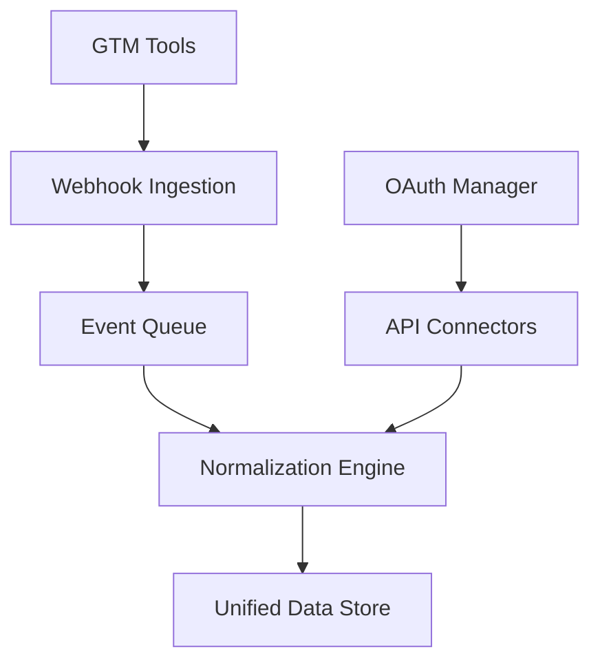
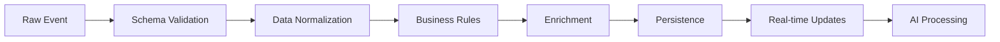
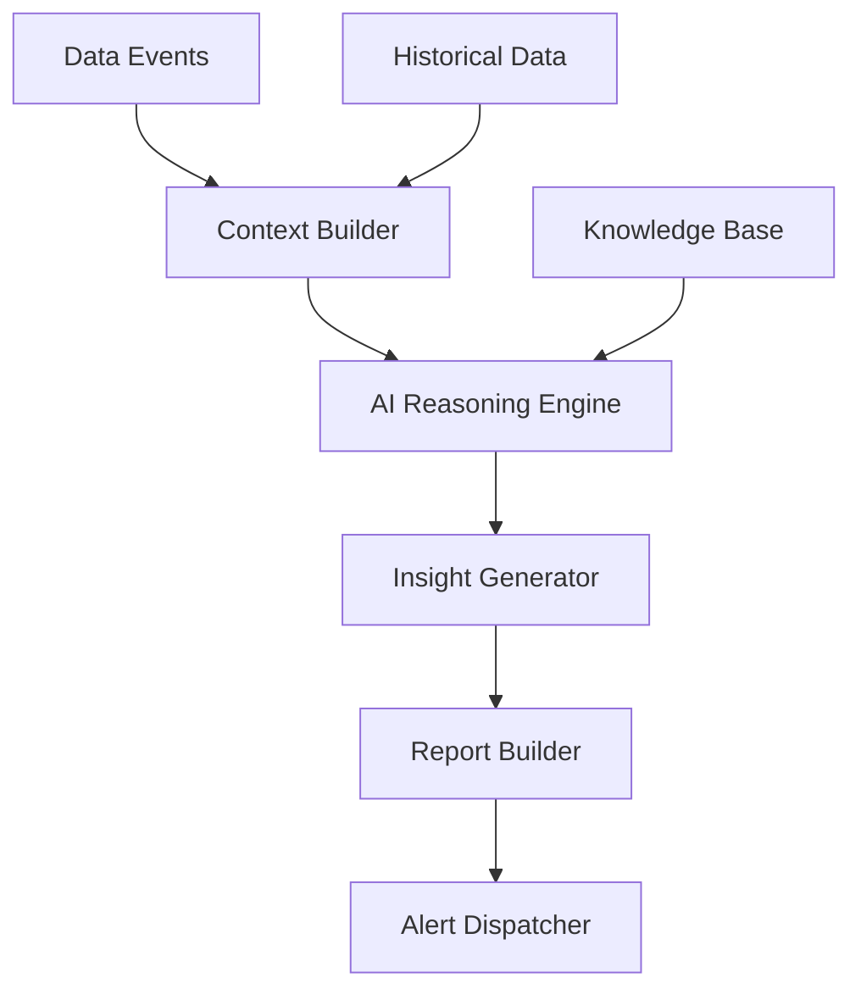
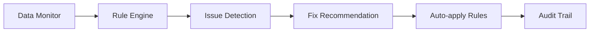
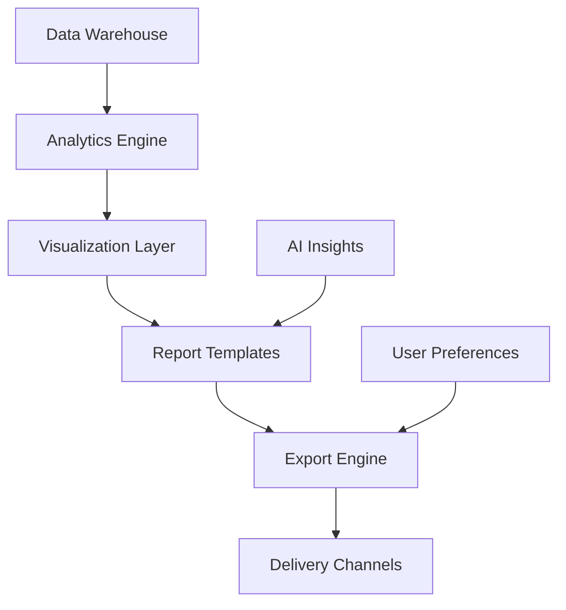

# RevOps Automation Platform - System Architecture

## Overview
A comprehensive RevOps Automation Platform that eliminates manual data work by unifying all GTM tools, automating data hygiene, and generating AI-powered leadership reports.

## Technical Stack

### Frontend
- **Framework**: Next.js 14+ (App Router)
- **Language**: TypeScript
- **Styling**: Tailwind CSS + Shadcn/ui
- **State Management**: Zustand + React Query
- **Charts**: Recharts + D3.js
- **Real-time**: WebSocket (Socket.io)
- **File Upload**: React Dropzone

### Backend Architecture
- **API Layer**: Next.js API Routes + Microservices
- **Event Bus**: Redis + Bull Queue
- **Webhooks**: Svix (webhook management)
- **Real-time Processing**: Node.js Workers
- **File Storage**: Supabase Storage
- **CDN**: Cloudflare

### Database & Storage
- **Primary DB**: Supabase (PostgreSQL 15+)
- **Cache**: Redis (event queue, session cache)
- **Time-Series**: InfluxDB (metrics analytics)
- **Search**: Elasticsearch (full-text search)
- **File Storage**: Supabase Storage + S3 backup

### AI & Analytics
- **LLM**: Anthropic Claude 3.5 Sonnet
- **Embeddings**: OpenAI text-embedding-3-small
- **Vector DB**: Pinecone (semantic search)
- **Forecasting**: Prophet + Custom ML models
- **Sentiment**: VADER + Custom sentiment analysis

### Integration Layer
- **OAuth2**: Authorization codes + refresh tokens
- **Webhooks**: Real-time event ingestion
- **API Clients**: Axios + Rate limiting
- **Data Normalization**: Custom transformation engine
- **Error Handling**: Circuit breaker pattern

### Security & Compliance
- **Auth**: Supabase Auth + Row Level Security
- **Encryption**: AES-256 at rest, TLS 1.3 in transit
- **Secrets**: AWS Secrets Manager
- **Audit Logs**: Immutable event logging
- **Compliance**: GDPR, CCPA, SOC 2 Type II

## System Components

### 1. Integration Hub


**Components:**
- Webhook Receiver (300+ events/second)
- API Connector Pool (concurrent API calls)
- Token Management (auto-refresh)
- Rate Limiting (per provider)
- Error Recovery (retry + fallback)

### 2. Data Processing Pipeline


**Stages:**
- Schema validation (JSON Schema)
- Field mapping (canonical format)
- Business rule application
- Data enrichment (external APIs)
- Multi-table persistence
- WebSocket broadcasting

### 3. AI Processing Engine


**Modules:**
- Context aggregation (deal + account + activities)
- Real-time reasoning (win probability, risk scoring)
- Report generation (templates + AI synthesis)
- Alert prioritization (severity + impact)
- Knowledge management (learned patterns)

### 4. CRM Hygiene Engine


**Capabilities:**
- Real-time hygiene monitoring
- 50+ hygiene rules out-of-the-box
- Custom rule builder
- Bulk fix operations
- Compliance checking

### 5. Reporting & Analytics


**Features:**
- Real-time dashboards
- Automated weekly/monthly reports
- Custom report builder
- Multi-format exports (PDF, PPT, Excel)
- Scheduled delivery (email, Slack, dashboard)

## Scalability Architecture

### Horizontal Scaling
- **API Servers**: Load balancer + container orchestration
- **Workers**: Auto-scaling based on queue depth
- **Database**: Read replicas + sharding by customer
- **Cache**: Redis Cluster with partitioning

### Performance Targets
- **Event Processing**: < 1 second from webhook to dashboard
- **Report Generation**: < 30 seconds for complex reports
- **API Response**: < 200ms for cached queries
- **Dashboard Load**: < 2 seconds initial load
- **Concurrent Users**: 10,000+ per instance

### Monitoring & Observability
- **Metrics**: Prometheus + Grafana
- **Logging**: ELK Stack (Elasticsearch, Logstash, Kibana)
- **Tracing**: OpenTelemetry
- **Error Tracking**: Sentry
- **Health Checks**: Custom health endpoints

## Integration Architecture

### Webhook Infrastructure
```typescript
interface WebhookEvent {
  provider: string;
  eventType: string;
  payload: any;
  timestamp: string;
  signature: string;
  customerId: string;
}
```

### API Connector Framework
```typescript
interface APIConnector {
  authenticate(): Promise<void>;
  fetch(endpoint: string, params?: any): Promise<any>;
  subscribe(events: string[]): Promise<void>;
  normalize(rawData: any): UnifiedEvent;
}
```

### Event Types by Provider

**CRM (Salesforce, HubSpot):**
- deal.created, deal.updated, deal.won, deal.lost
- contact.created, contact.updated
- account.created, account.updated

**Sales Engagement (Outreach, Salesloft, Gong):**
- sequence.started, sequence.replied
- call.completed, meeting.scheduled
- email.sent, email.replied, email.opened

**Marketing (HubSpot Marketing, Marketo):**
- campaign.started, campaign.ended
- lead.created, lead.converted
- email.sent, email.opened, email.clicked

**Support (Zendesk, Freshdesk):**
- ticket.created, ticket.updated, ticket.closed
- customer.satisfaction, csat.score

**Billing (Stripe, Chargebee):**
- invoice.created, invoice.paid, invoice.failed
- subscription.created, subscription.cancelled
- customer.created, customer.updated

**Communication (Gmail, Google Calendar):**
- email.sent, email.received
- meeting.scheduled, meeting.completed

**Collaboration (Slack, Teams):**
- message.posted, channel.created
- user.activity, team.member_added

## Data Flow Architecture

### Real-time Processing
1. **Event Ingestion** (Webhook → Queue)
2. **Validation & Authentication** (Security checks)
3. **Normalization** (Schema mapping)
4. **Business Logic** (Rules engine)
5. **Persistence** (Database writes)
6. **Real-time Updates** (WebSocket broadcast)
7. **AI Processing** (Background job)
8. **Alerting** (Notification dispatch)

### Batch Processing
1. **Data Sync** (Full sync from APIs)
2. **Historical Analysis** (Trend detection)
3. **Report Generation** (Scheduled reports)
4. **Data Cleanup** (Archive, compress)
5. **Backup Operations** (Disaster recovery)

## Security Architecture

### Data Protection
- **Encryption at Rest**: AES-256 for all customer data
- **Encryption in Transit**: TLS 1.3 for all communications
- **Field-level Encryption**: Sensitive fields (PII, financial)
- **Data Masking**: Development environment anonymization

### Access Control
- **Authentication**: SSO + Multi-factor authentication
- **Authorization**: RBAC with granular permissions
- **API Security**: Rate limiting, request validation
- **Audit Logging**: Immutable audit trail for all data access

### Compliance
- **GDPR**: Right to be forgotten, data portability
- **CCPA**: Consumer privacy rights
- **SOC 2**: Security controls and attestation
- **HIPAA**: Healthcare data protection (if applicable)

## Deployment Architecture

### Environment Strategy
- **Development**: Local Docker + Supabase local
- **Staging**: Production-like environment
- **Production**: Multi-region high-availability

### Infrastructure as Code
- **Terraform**: Infrastructure provisioning
- **Docker**: Container orchestration
- **Kubernetes**: Application deployment
- **GitHub Actions**: CI/CD pipeline

### Disaster Recovery
- **Backups**: Daily automated with point-in-time recovery
- **Failover**: Multi-region active-passive setup
- **RPO/RTO**: < 1 hour recovery point, < 5 minutes recovery time
- **Testing**: Quarterly disaster recovery drills
